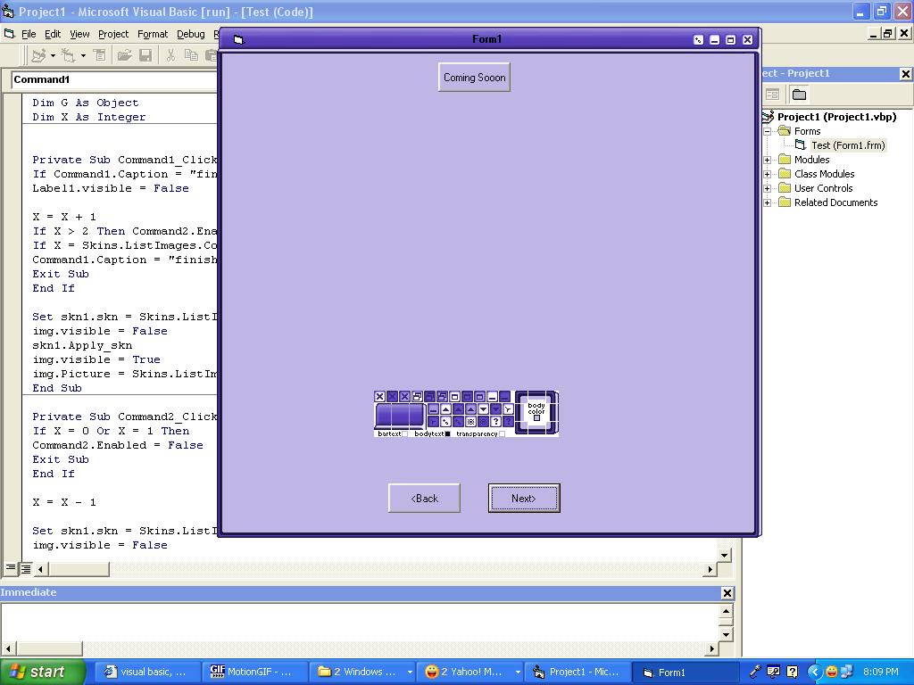



## Multi\_skinner

### Description

PLease WHo ever voted 4 me please vote again i was just editing the name and it was deleted so iam very soory and as befeore this a multi skinning engine that supports all the skins of vbkinner pro i have placed about 80 skins with it and iam developing it to support more skins like winamp and windows blinds so please vote and comment and report any bugs and ideas
 
### More Info
 

             |
---                |---
**Submitted On**   |2005-02-27 20:45:34
**By**             |[silver\_fox\_vb](https://github.com/Planet-Source-Code/PSCIndex/blob/master/ByAuthor/silver-fox-vb.md)
**Level**          |Beginner
**User Rating**    |4.6 (205 globes from 45 users)
**Compatibility**  |VB 6\.0
**Category**       |[Custom Controls/ Forms/  Menus](https://github.com/Planet-Source-Code/PSCIndex/blob/master/ByCategory/custom-controls-forms-menus__1-4.md)
**World**          |[Visual Basic](https://github.com/Planet-Source-Code/PSCIndex/blob/master/ByWorld/visual-basic.md)
**Archive File**   |[Multi\_skin185911312005\.zip](https://github.com/Planet-Source-Code/silver-fox-vb-multi-skinner__1-59221/archive/master.zip)

